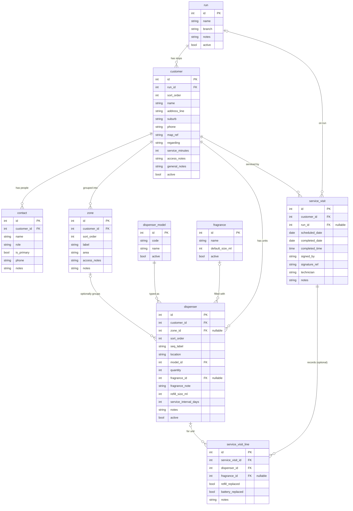

# Ecomist service run — data model

A proposed data model to store the information in an Ecomist **service run sheet**
and later regenerate a report like it.

Derived from `.local/Waverley Commercial Run 30 June.pdf` — an 8-page run sheet
exported from ACT! CRM (database "Ecomist Burwood"). Ecomist installs and services
automatic aerosol fragrance dispensers; the sheet is one *run*
("Waverley Commercial") listing every client site a technician visits on a date,
with per-dispenser servicing instructions and a sign-off block per site.

Status: **implemented** — the live schema is `migrations/0001_init.sql`, which
follows this design with the deviations listed in "As implemented" at the end
(multi-franchise tenancy, run-sheet execution tables, simplified lookups).

---

## Design at a glance

Three layers:

- **Reference** — the small catalogs (`dispenser_model`, `fragrance`) that
  normalise messy free-text and drive tallies.
- **Configuration** — the standing install: which sites are on which run, who to
  ask for, and every mounted dispenser. Changes rarely.
- **Operational** — what happened on a visit (`service_visit`). Grows over time;
  the same install is serviced again and again.

Keeping configuration separate from visits is the central decision: the install
is stable, but it's serviced repeatedly, and printed **tallies are always
computed, never stored**, so they can't drift.

---

## Entity–relationship diagram

---

## Tables

### Reference

#### `dispenser_model`
Normalises the model spellings in the sheet ("Eco MAXI", "Eco Midi", "Eco Midi
Pro", "EcoProC", "Eco Pro C", "ECO6") and drives the `x Maxi / y Midi` tallies.

| column | type | notes |
|---|---|---|
| id | int PK | |
| code | text | `MAXI`, `MIDI`, `MIDI_PRO`, `PROC`, `ECO6` |
| name | text | display name, e.g. "Eco Midi Pro" |
| active | bool | |

#### `fragrance`
| column | type | notes |
|---|---|---|
| id | int PK | |
| name | text | Brandon, Baby Talc, Peach Passion, Eucalyptus, Citrus Vanilla, Lemon Talc, Moonlight Dancer, Angel, Marshall, Jupiter, NIK, No Fragrance |
| default_size_ml | int | typically 650 |
| active | bool | |

> "See Below" / "Various" is **not** a fragrance row — it's a null `fragrance_id`
> plus `fragrance_note` on the dispenser (see below).

### Configuration

#### `run`
| column | type | notes |
|---|---|---|
| id | int PK | |
| name | text | "Waverley Commercial" |
| branch | text | "Ecomist Burwood" (the ACT! database) |
| notes | text | |
| active | bool | |

#### `customer` (site)
| column | type | notes |
|---|---|---|
| id | int PK | |
| run_id | int FK → run | which route this stop belongs to |
| sort_order | int | position of the stop within the run |
| name | text | "Waverley Private Hospital" |
| address_line | text | "343 - 357 Blackburn Road" |
| suburb | text | "MOUNT WAVERLEY" |
| phone | text | |
| map_ref | text | Melways ref, "70 J3" |
| regarding | text | default "Service Dispensers" |
| service_minutes | int | est. duration, e.g. 15 |
| access_notes | text | free text: "Need ladder", "MUST CALL THE DAY BEFORE", door codes, service-day/hour limits |
| general_notes | text | e.g. "Please rotate between Lemon Talc, Citrus Vanilla where not specified" |
| active | bool | |

> **Alternative if a site can appear on multiple runs:** drop `run_id`/`sort_order`
> from `customer` and add a join table
> `run_stop(run_id, customer_id, sort_order)`. The one-run-per-site form above is
> simpler and matches the current sheet; switch only when needed.

#### `contact`
| column | type | notes |
|---|---|---|
| id | int PK | |
| customer_id | int FK → customer | |
| name | text | "Stuart", "Carol Thorley" |
| role | text | free text: Maintenance Manager, Practice Manager, DON, Reception, Owner… |
| is_primary | bool | the "Scheduled With" person for the visit |
| phone | text | |
| notes | text | |

#### `zone` (optional grouping within a site)
| column | type | notes |
|---|---|---|
| id | int PK | |
| customer_id | int FK → customer | |
| sort_order | int | |
| label | text | "ZONE 1" |
| area | text | "GROUND FLOOR", "APPLES WING", "LEVEL 1" |
| access_notes | text | zone-specific door/lift codes |
| notes | text | |

> Flat sites (bakery, butcher, dental) have no zones — those dispensers simply
> have a null `zone_id`.

#### `dispenser` (installation point / numbered line)
| column | type | notes |
|---|---|---|
| id | int PK | |
| customer_id | int FK → customer | |
| zone_id | int FK → zone | **nullable** |
| sort_order | int | numeric, for ordering (1, 2, 3…) |
| seq_label | text | printed label; handles ranges: "1", "9 - 10", "62 - 63" |
| location | text | "Foyer Area, around from Reception" |
| model_id | int FK → dispenser_model | |
| quantity | int | 1 or 2 — covers ranged lines (`9 - 10 … x 2`) |
| fragrance_id | int FK → fragrance | **nullable** (null ⇒ see `fragrance_note`) |
| fragrance_note | text | "See Below", "Various (see below)" |
| refill_size_ml | int | 650 |
| service_interval_days | int | 70 / 35 / 42 |
| notes | text | hours "M-F 7.30-4.30pm", "Cont 1", per-unit door code |
| active | bool | |

### Operational

#### `service_visit` (the sign-off block, one per completed visit)
| column | type | notes |
|---|---|---|
| id | int PK | |
| customer_id | int FK → customer | |
| run_id | int FK → run | nullable |
| scheduled_date | date | |
| completed_date | date | from the "Date:" line |
| completed_time | time | from the "Time:" line |
| signed_by | text | "Contact Name" / "Client Signature" |
| signature_ref | text | path/handle to a captured signature image |
| technician | text | who serviced it |
| notes | text | |

#### `service_visit_line` *(optional future extension)*
Per-dispenser record of what was actually done on a visit. Not required to
reproduce the current sheet; included so the model has a clear growth path toward
service history.

| column | type | notes |
|---|---|---|
| id | int PK | |
| service_visit_id | int FK → service_visit | |
| dispenser_id | int FK → dispenser | |
| fragrance_id | int FK → fragrance | nullable — what was actually fitted |
| refill_replaced | bool | |
| battery_replaced | bool | |
| notes | text | |

---

## Derived values — never stored

The printed totals are computed by grouping `dispenser` lines and summing
`quantity`:

- **Site total** (`31 DISPENSERS`) = `SUM(quantity)` for the customer.
- **Site tally** (`16 x Maxi / 15 x Midi`) = `SUM(quantity)` grouped by
  `model_id`.
- **Zone tally** (`5 Maxi / 1 Midi`) = the same grouped by `zone_id`.

Storing these would let them drift out of sync with the dispenser rows, so they
are always calculated at render time.

---

## Regenerating the report

For a chosen `(run, date)`:

1. Load the `run`.
2. Load its `customer`s ordered by `sort_order`.
3. For each site, render the header — name, address (`address_line` + `suburb`),
   `map_ref`, `phone`; the primary `contact` plus the others; `access_notes` and
   `general_notes`; and the **computed** model tally.
4. Load `zone`s ordered by `sort_order`; under each, the `dispenser`s ordered by
   `sort_order`. Print `seq_label`, `location`, model, fragrance
   (`fragrance.name` or `fragrance_note`), size, `service_interval_days`, and
   `notes`. Dispensers with a null `zone_id` render in an ungrouped list.
5. Emit a blank `service_visit` sign-off block (Contact Name / Signature / Date /
   Time) for the tech to complete.

The planned **cleaner redesign** keeps this data but can group by zone with count
chips and badge model / fragrance / interval — a fresher layout over the same
model.

---

## Data-quality notes baked into the design

- **Dates in the print are unreliable** — the filename says "30 June", the body
  says `26/10/2025`, the footer says "Friday 26 June 2026". Store real
  `DATE`/`TIME` values on `service_visit`; never parse them back out of rendered
  text.
- **Normalise models & fragrances** via the reference tables; keep an import alias
  map (e.g. "Eco Pro C" == "EcoProC" ⇒ `PROC`; "Eco Midi Pro" ⇒ `MIDI_PRO`).
- **Ranged / multi-unit lines** (`9 - 10 … x 2`) → `seq_label` for display +
  `quantity` for maths.
- **"See Below" / "Various" fragrance** → null `fragrance_id` + `fragrance_note`.
- **Not every site has zones** → `zone_id` is nullable on `dispenser`.

---

## Worked verification against the source PDF

The eight sites on the sheet all fit, including the awkward ones:

| Site | Zones? | Notable cases the model must hold | Result |
|---|---|---|---|
| Waverley Private Hospital | 5 zones + un-zoned "New Consulting Building" | ranged lines (`9 - 10 x2`, `14 - 15 x2`), many door/lift codes, "See Below" & "No Fragrance", `general_notes` rotate rule | ✅ |
| Pinewood Dental Group | none | flat `EcoProC` list, null `zone_id` | ✅ |
| AVEO Oak Tree Hill Village | none | "Do not change fragrance without OK…" → `access_notes` | ✅ |
| Australian Unity (Campbell Place) | 6 zones | "MUST CALL THE DAY BEFORE" + door code → `access_notes`; largest tally (63) | ✅ |
| Kerrie Road Bakery | none | mixed intervals (35 & 42 days), `ECO6` model, per-unit hours in `notes` | ✅ |
| Scusa Mi Italiano | none | per-unit "7D M-S 10am-10pm Const 2" → `notes`; missing map_ref (nullable) | ✅ |
| Snuggles / Story House ELCs | none | "See Below" fragrance, operating-hours notes | ✅ |
| Aron's Butchers / Waverley Endoscopy | none | "Previously: Cannings" + service-day limits → notes; ranged line `1 - 2 x2` | ✅ |

**Tally check** — Waverley Private Hospital: grouping its 31 units by model gives
16 `MAXI` + 15 `MIDI` = **31**, matching the printed `16 x Maxi / 15 x Midi` and
`31 DISPENSERS`. Zone 1's lines sum to `5 Maxi / 1 Midi`, matching the printed
`(5 Maxi / 1 Midi)`.

Every element printed on the sheet is reachable from the model, and no field in
the PDF is left without a home.

---

## As implemented (deltas from the design above)

The live schema is `migrations/0001_init.sql`. It follows this design with
these deliberate changes:

- **Tenancy:** `franchises` is first-class (the PDF's "Database: Ecomist
  Burwood" is a franchise). `runs` and `customers` carry `franchise_id`;
  `users` belong to a franchise (`NULL` + `is_admin=1` = all franchises);
  `approved_emails(email, franchise_id)` pre-approves Google sign-ins;
  `sessions` store an admin's currently selected franchise. Lookup catalogs
  (`dispenser_models`, `fragrances`) stay global across franchises.
- **Lookups simplified:** `dispenser_models` has `name` only (no `code`) —
  names are unique NOCASE and get created on the fly from the typeahead, so a
  separate code adds friction without value.
- **Operational model:** the single `service_visit` became three tables:
  - `run_sheets(run_id, run_date, status open|completed, created_by, ...)` —
    one execution of a run;
  - `run_sheet_stops(run_sheet_id, customer_id, sort_order, status
    pending|done|skipped, note, completed_at/by)` — the stop list frozen at
    start time (the sign-off block equivalent);
  - `run_sheet_ticks(run_sheet_id, dispenser_id, ticked_by, ticked_at, note)`
    — tick = INSERT, untick = DELETE, unique per (sheet, dispenser).
  A stop auto-completes when the sum of ticked quantities reaches the
  customer's active unit total, and reopens if a tick is removed.
- **Tallies remain computed** (`CAST(SUM(quantity) AS INTEGER)` group-bys) —
  never stored, exactly as designed.
- The run sheet turned out to hold **10** customers, not 8 (the earlier table
  above merges two pairs of rows).
